# Course Manual One

This course manual should guide you through the process of setting up your system and peforming your first measurments using LabVIEW [#todo review this intro text]

## Setting up the System
If you are using the Emulator, load it by navigating to `LabVIEW Instrument Emulator/builds/HandsOn/CTIPicoVISAEmulator/`
    
* Right-click in the window and select Open Terminal Here

  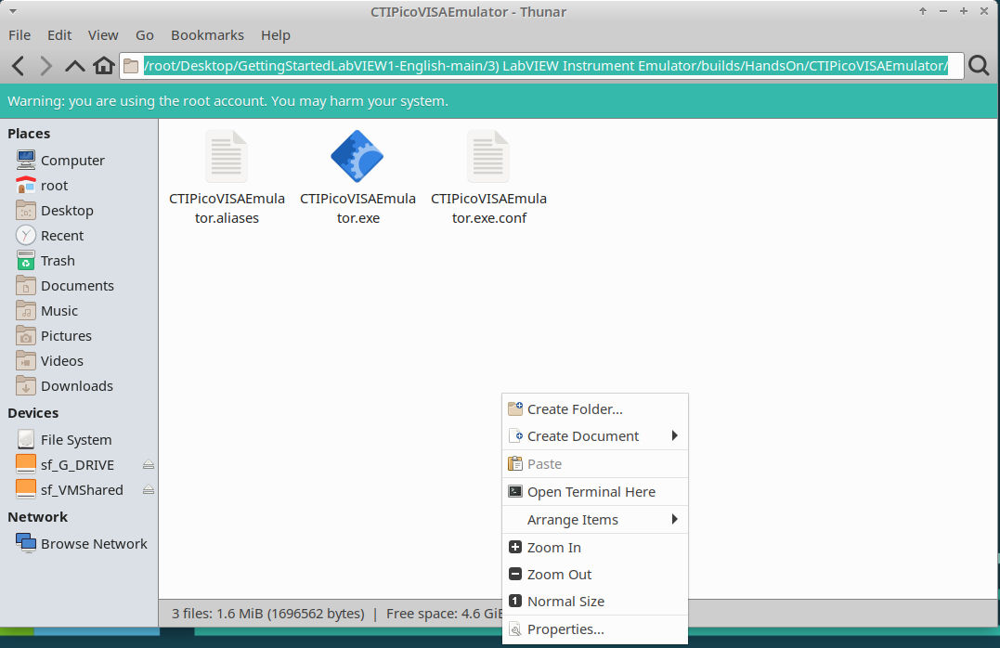

* Type in `./CTIPicoVISAEmulator.exe`

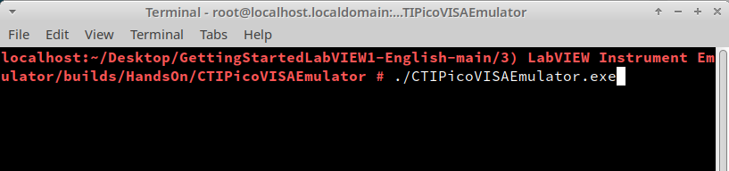

* Selet the correct subnet when prompted to by the pop-up window

<!-- use figure to centre image-->
<figure markdown>
  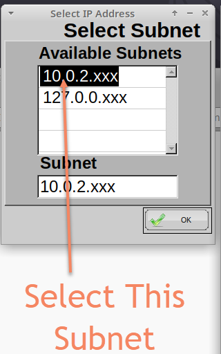
</figure>

!!! Success "Emulator Setup Complete" 
    The emulator should now be ready to use and “Connecting” will be displayed in status bar.

    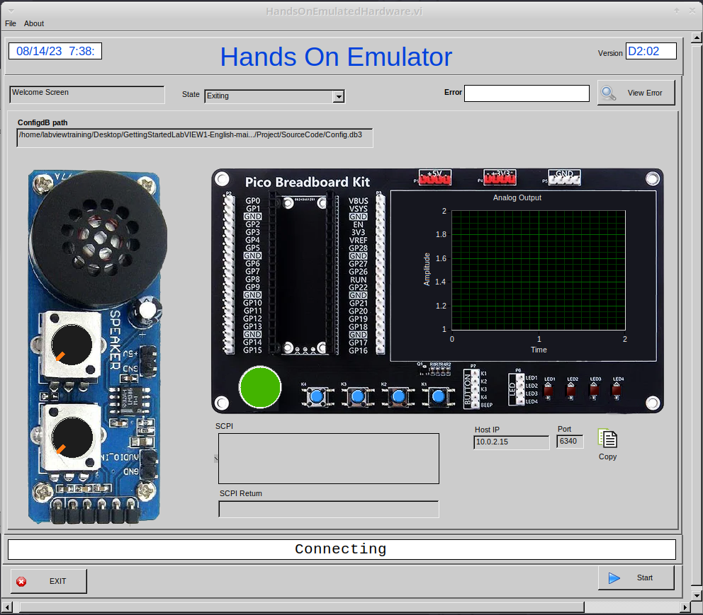

## Lesson 1 – LabVIEW “Hello World” LED On/Off
!!! info "Setting up the Hardware" 
    If you have the hardware for this course then you will need to set up and wire it as shown in the image below. 
    If not skip to [Lesson Instructions](#lesson-instructions).

    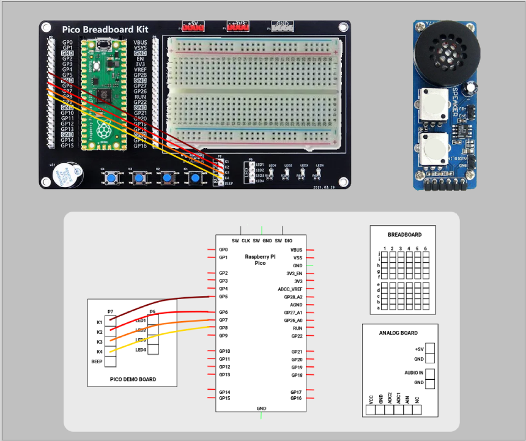

    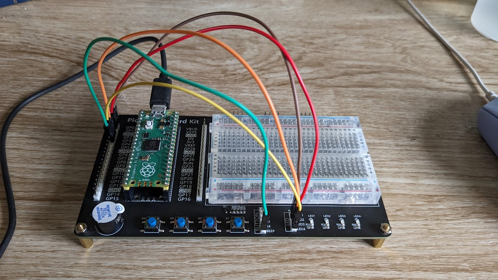

### Lesson Instructions
The LabVIEW version of a “Hello World” program is to make a piece of hardware do something basic, usually it is turning an LED On and Off.
Load LabVIEW and select a New VI.

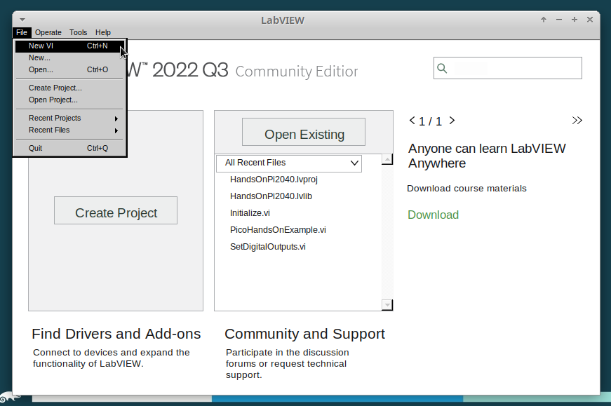

Setup the screen like this:

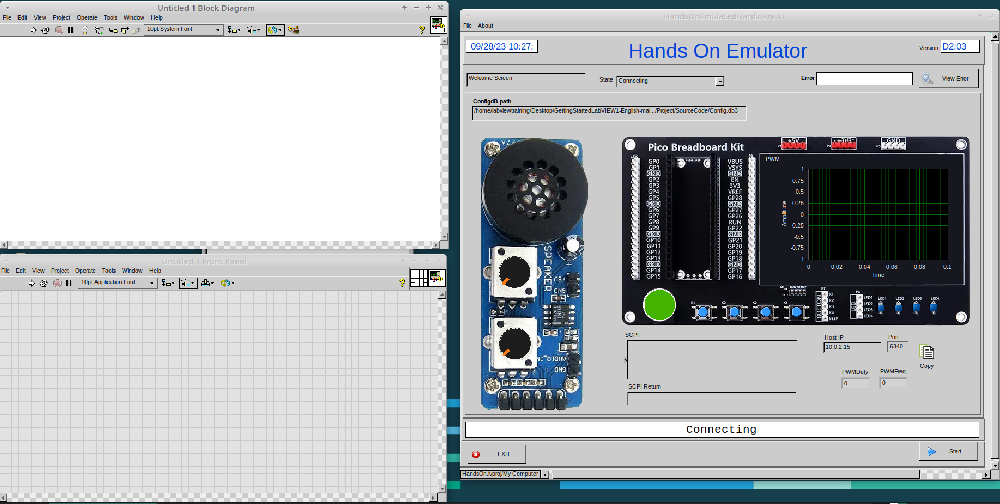

In LabVIEW a VI is a Virtual Instrument is equivalent to a function or module in other languages. A LabVIEW program is made up of 1 or more VIs. 

* In the block diagram right-click and navigate to the HandsOnPi2040 Driver Palette

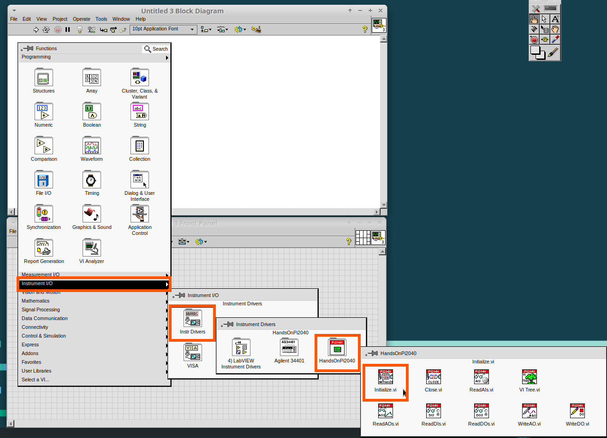

* Drag and drop Initialize.vi, WriteDO.vi and Close.vi onto the block diagram as shown below.

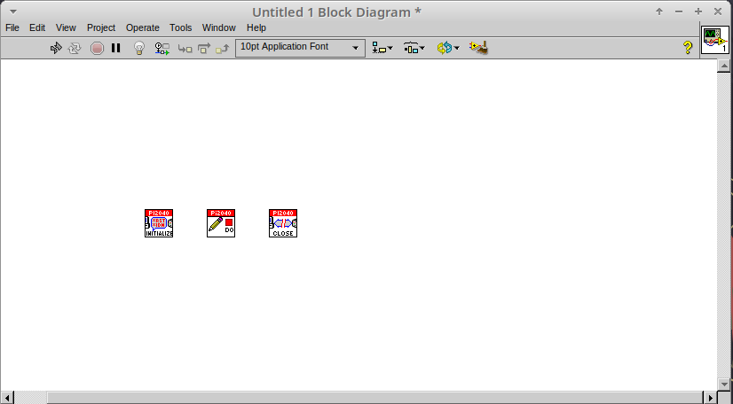

*Notice that the Run-arrow is broken (the run arrow appears in the top left corner), if you press it, it will list all the reasons why it’s broken.*

<!-- use figure to centre image-->
<figure markdown>
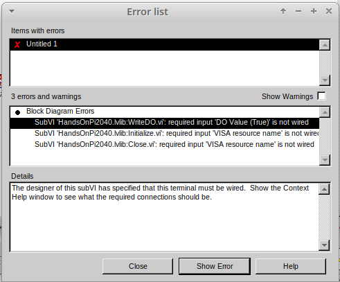
</figure>

* LabVIEW will not let you run the source-code until these errors are sorted. Close the Error List and select all of the Vis. (Left-click drag on mouse).

<!-- use figure to centre image-->
<figure markdown>
  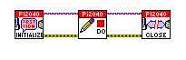
</figure>

* Press Ctrl+space to bring up quick drop and Ctrl+W to wire the VIs together. Quick drop is an extremely useful productivity tool that ships with LabVIEW. It allows you to automate repetitive tasks with a few key combos.

*If you press the Run arrow now you will notice that there are only 2 issues listed, good job!*

* Press Ctrl-H to bring up the context help window. Hover over `Initialize.vi`.

!!! danger
    This remaining content has not been converted to markdown yet!

Notice that VISA resource name is bold. This means that it needs to have an input.

* Now, right-click on VISA Resource Name Initialize.vi and select create constant.

If you press the Run arrow now you will notice that there is only 1 issue left.

This VI needs it’s Output and DO Value (True) wiring. So let’s create constants for them. Use the arrow on the right to select an output.

I 
t’s nice to have the constant label shown for booleans. 

* Right click on the ‘True’ Boolean Constant. This will bring up a drop down window, hover over ‘Visible Items’ and select ‘Label’.

Constants are terminals on the block diagram that supply fixed data values to the diagram. We’ll discuss data types etc. later in the session.

* Finally let’s wire in a couple of outputs. 

* Right-click on IDN for Initialize.vi and select ‘Create Indicator’. Then we need an error out, so right click at the bottom the Close.vi and select ‘Create Indicator’.

Notice how the Indicators appear on the Front Panel. We’ll discuss block-diagrams and front panels in a bit.

Now we have a running program!

However, you will notice the we’ll have an error.

* We can interrogate the error message to try and get a clue as to why it all went so wrong. Sometimes it can even be helpful.

In this case it is!

* The VIs don’t know who they are talking to. To fix this, hardware users need to set the correct VISA reference from the ‘VISA’ drop down box.. For Emulator users click the ‘Copy’ button, as seen in the image below and paste the reference in, if you have hardware refresh and select the ASRL reference.

* Now press run again.

Here we can see that no errors were apparent and Identity has a value.

But more importantly t 
he LED on the hardware has turned on.

Lesson 2 – For Loops
Optional: Setting up the Hardware
W 
ire your hardware like the image below. 
Lesson Instructions
A For Loop executes a sub-diagram a set number of times. In this case you will learn how to build a program that will blink the previous LED on and off 10 times each and then stop.

* Make your workspace bigger to allow space for adding objects. Use Ctrl then drag to expand.

* Alternatively select the objects you need to move with the selection tool and drag them where you want with the mouse, or using the arrows.

Note: press Shift and an arrow key to move selected items quicker.

* Now insert a For Loop, to do this right click anywhere on the block diagram to bring up the functions palette. Select ‘Structures’ then ‘For Loop’.

* You will only need to place the For Loop around the WriteDO SubVI (and the constants attached to it.) 

* Once the For Loop has been placed, you will see an ‘N’ in the top left corner, this is the loop count (or how many times the loop will execute.) 

* Right click on the left hand side of the Loop Count, and select ‘Create a Constant’. For this task you will need the Loop Count to be 20 (10 times on and 10 times off.)

In order for the program to ‘blink’ successfully it will need to know what the previous loop has executed, therefore you will need a Shift Register. 

* Right click on the edge of the For Loop and select ‘Add Shift Register.’ Wire the True Constant to the Shift Registers and the DO (Value) wire terminal. 

If you were to run the program at this point the LED would light up, but would not ‘blink.’ 

* For a blinking LED you will need to invert the boolean value after every loop. To do this right click anywhere to bring up the functions palette. Hover over ‘Boolean’ then select the ‘Not’ Boolean. Wire this into the shift registers.

The program will now work! However, it will execute very fast, and you will not be able to see the LED blinking. So you need to slow the Loop down.

* Right click inside the For Loop, hover over ‘Timing.’ There will see many different timing options. For this you will use the ‘Wait’ function. Select and place inside the Loop. 

* Create a constant by right clicking on the left side of the ‘Wait’ function. The ‘Wait’ function executes in milliseconds, therefore to slow down the Loop by 5 seconds, write 500.

* Now Run the program. You have successfully used a For Loop to blink the Digital Output.
Lesson 3 – While Loops

Optional: Setting up the Hardware
Wire your hardware like the image below.

Lesson Instructions
The While Loop executes the sub-diagram until a specific condition occurs. It will always execute at least one time.

In this case, you want the LED to continually blink on and off until a ‘Stop’ button is pressed. You can create this using the previously built program with the For Loop.

* Firstly, right click on the edge of the For Loop, and select ‘Replace with While Loop’

* Now the For Loop has been replaced, the Loop Count is not connected. This is not needed for a While Loop and can be deleted.

* To add a ‘Stop’ boolean, switch to the front panel window and right click where you want to place the button. The Controls palette will appear, select ‘Boolean’ and pick a button. The example uses a ‘Push Button’ but any will work.

* Back on the Block Diagram move the new Control Boolean into the While Loop and wire it up to the Conditional Terminal in the bottom right corner. If the Button on the Front Panel is pressed when the program is running then the Loop will end and the ‘blinking’ LED will stop.

Exercise – Use DI to stop the loop
Hint: wiring diagram for DI
H 
int: VI for DI

Lesson 4 – Event Structure
Optional: Setting up the Hardware
Wire your hardware like the image below.

Lesson Instructions
An Event Structure waits until a certain event occurs, then executes the appropriate case to handle that event. In this example, we want to press a buttons and the corresponding light to turn on. 

* First lets delete the while loop and its contents. Click on the While Loop and press the delete key. Do the same for the ‘True’ constant. Then remove the broken wires with Ctrl+B.

* Right click to bring up the Functions Palette, hover over ‘Structures’ then select ‘Event Structure.’ Place the Event Structure on the Block Diagram.

* Wire the Initialize VI and the Close VI through the Event Structure.
* A 
dd a new Event Case by right clicking on the Selector Label, and select ‘Add Event Case.’
* A 

dd the WriteDO.vi by bringing up the Functions Palette, hover over ‘Instrument I/O’, ‘Instr Drivers,’ ‘HandsOnPi2040,’ and select ‘WriteDO.vi. 
* Drag the sub VI inside the Event Structure and wire it up. Right click the Output terminal and create a Constant.
* C 
hange the Output from ‘No DO – Error’ to ‘DO1’ by clicking the drop down arrow on the Output Constant.

* Next we need to add a button for the Digital Output. Go to the Front Panel, and right click anywhere to bring up the Controls Palette. Hover over ‘Boolean,’ and select ‘Push Button’
* W 

ire the new Boolean Control into the ‘DO Value’ terminal.
* Right click on the Label Selector as we need to ‘Edit Events Handled by This Case.’
* T 
his will bring up the ‘Edit Events’ window. Select ‘Boolean.’ 

* This Event Case is now complete. We will need 3 more Event Cases, each one corresponding to a LED. The easiest way to do this is to right click the Label Selector, and select ‘Duplicate Event Case.’
* S 
elect ‘Boolean 2’ on the Edit Events window.

* It’s important to change the DO Constant when the case has been duplicated. (DO1 for Boolean, DO2 for Boolean 2, etc.) Duplicate this case 2 more times for DO3, and DO4.
* A 
t this point your Front Panel may look a little messy, take some time to clean it up. This will make it easier to use when you have finished building the program.
Y 

ou will be able to Run the program now, however, it will Stop after one Boolean has been selected. We can make this more efficient. 
* Back on the Block Diagram we will need to add a While Loop. Right click to bring up the Functions Palette, hover over ‘Structures’ and select ‘While Loop.’
* P 

lace the While Loop around the Event Structure.
* Go to the Front Panel, so we can add a ‘Stop’ button that we’ll connect to the Loop Condition. Right click to bring up the Controls Palette, hover over ‘Boolean, then select ‘Stop Button.’
* W 

e will also need to create a new Event Case for this Stop button. Right click on the Selector Label and select ‘Add Event Case.’
* Place the ‘Stop’ control inside the new case.
* R 
ight click the Selector Label and select ‘Edit Events Handled by This Case’

* When the ‘Edit Events’ window pops up choose the ‘stop’ option in the ‘Event Sources’ table.
* O 
ur last step is to wire a ‘True’ constant to the Loop condition. Right click to bring up the Functions Palette, hover over ‘Boolean’ and select ‘True Constant.’
* Place the Constant inside the Event Structure.
      
* Wire the constant to the Loop Condition, like the image below.
* T 
he program will now run successfully. You will be able to turn the LEDs on and off as many times as you want. You can use the Stop button to stop the execution of the program.

Lesson 5 – Numbers, Graphs and Charts
Optional: Setting up the Hardware
Wire your hardware like the image below.

Lesson Instructions
Analog Input
Now you have made working programs using Digital Inputs and Outputs, it’s time to have a look at the Analog Inputs and Outputs. 
For this lesson you will be focusing on the Analog Inputs (or Analog sticks). 

* Like the lessons before, start with placing the Initialize.vi, and the Close.vi on a new Block Diagram.

* Right click to bring up the Functions Palette. Follow along with the image below and place the ReadAI.vi on the diagram. 
* Y 
ou want to create a constant by right clicking on Analog Input on the left of the ReadAIs.vi, and selecting Create Constant.

* C 
reate an Indicator for the Analog value on the right side of the vi.
* W 
ire your program like the image below.
      The program will successfully run at this point, however, it will execute too fast to move the Analog Sticks for continuous data.
* To 
fix this issue, you can add a While Loop. Bring up the Functions Palette, then ‘Structures’, and select ‘While Loop’. Place this around the ReadAIs.vi, but leave space for other functions.
* A 
While Loop will not work without adding a Loop Condition. In most cases this will simply be a Stop Boolean. Right click on the Loop Condition and ‘Create Control’.
      T 
his will automatically add a Stop Boolean onto the Front Panel.
* You can run the program now and when you turn the Analog Sticks the value will show.
I 
f you are using physical Pico Bread Board and Analog Board you will notice the ‘Value’ Indicator will flicker between numbers, this is normal and is simply extra ‘noise’ from the equipment.
* However, it is also possible to replace this with a Chart which will show the data continuously. R ight click on the Value Indicator, and hover over Replace. This will bring up the Control Palette. Select Graph and then a Waveform Chart. 
Analog Output (Write)

* B 
eginning with a Block Diagram with an Initialize.vi and a Close.vi. Right click to bring up the Functions Palette. Follow along with the image below and add the WriteAO.vi onto the diagram. 
* Wire up the 3 VIs.
* Right click on the ‘Analog Output’ terminal and Create a Constant. For this exercise the Analog Output will produce 2 different pieces of numerical data, therefore 2 constants will be grouped into 
a Cluster.

* You will need to create a Bundle. Right click on the Block Diagram to bring up the Functions palette, hover over ‘Cluster, Class, & Variant, then select ‘Bundle By Name.’

* Delete the wire connected to the subVI, as it needs to be wired into the bundle you built before.
* W 
ire the bundle and the like the image below.
* Once wired up 
, you will notice that the bundle has the label ‘Duty’. Expand the Bundle down so the ‘Frequency’ label is visib 
le.
* Right click at the edge of the bundle and create Constants for ‘Duty’ and ‘Frequency.’
* T 
he fr 
ont panel should look like the image below. However, this needs some adjusting. 
      Using ‘Numeric Control’ may be a little fiddly when the program runs, so in this case you will swap these out for ‘Vertical Pointer Slides.’ 
* R 

ight click on the ‘Duty’ Control and hover over ‘Replace.’ Select ‘Numeric’ and then ‘Vertical Pointer Slide.’ Do the same for the ‘Frequency’ Control.
* Y 
ou will need to change the ‘Scale’ of the ‘Frequency’ slider. Right click on the Slider, select ‘Scale’, ‘Mapping’, then ‘Logarithmic.’
A logarithmic scale is useful when the data you are displaying is much less or much more than the rest of the data, or when the percentage differences between values are important. 
* The ‘Duty’ slider can stay as a Linear scale. 
* N 

ow you need to set the top and bottom points on the sliders. You will only need to change the highest point for ‘Duty’. Set it to ‘1’.
* For ‘Frequency’ the lowest point should be ‘10’ and the highest ‘500,000.’
Now let’s head back to the Block Diagram and finish building the program.
* B 
ring up the Functions Palette by right clicking on the Block Diagram, hover over ‘Structures’ and select a For Loop. Place the For Loop around the WriteAO.vi.
* A For Loop needs a ‘Loop Count.’ Choose a number that will allow you to time to use the dials and see how it executes on the Waveform Chart.

* You will need to slow down the Program before running it. Bring up the Functions Palette, select ‘Timing’ and place the ‘Wait (ms)’ function inside the For Loop.
* Right 
click the left hand terminal on the Wait function and create a Constant. Type in ‘100’ this will slow the program down enough for you to see the results.
      
* Y ou can now run your program. Move the Vertical Pointer Slides up and down and you will be results will show on the Emulator. 
Analog Output (Read)
If you want a more accurate representation for the ‘Duty’ and ‘Frequency’ sliders you can use the ReadAOs.vi.
Place the ReadAOs.vi inside the For Loop by repeat the same process you learnt at the beginning of the Anal 
og Output (Write) lesson.
* W 
ire the subVI as show in the image below. Right click on the ‘AnalogOutput’ terminal and create a Constant, then create an Indicator for the ‘AnOutValues.’
* Y 
ou can now run the program, and you will see the Values for ‘Duty’ and ‘Frequency’ on the Front Panel.
If you are usi 
ng the Simulator the values for both will appear on the Emulator.
General Concepts
VIs (Virtual Instruments)
Programs in LabVIEW are called VIs (Virtual Instruments). In other programming languages a VI is similar to a function or a subroutine. A VI includes a Front Panel and a Block Diagram, the VIs Icon and its Connector Pane.

* Front Panel
      The front panel window is the user interface for the VI. You create the window with controls and indicators, these are the interactive input and output terminals of the VI.
* Block Diagram
      The Block Diagram is where you will create the code for your program. The block diagram will implement graphical representations of functions to control the objects on the front panel. Objects on the front panel will appear as terminals on the block diagram. 
* Icons, Connector Panes, and SubVIs
      The icon and connector pane allow you to use and view the VI in another VI. This is called a SubVI, to use a SubVI you must build a connector pane. Customising the Icon is recommended to help with reading and understanding the program.
        ◦ The Icon is displayed in the upper right corner of the VI, it is a graphical representation of the VI. The icon can be customised with text and images to help identify what the VI does. 
        ◦ The connector pane is a set of terminals on the icon the corresponds to the controls and indicators of the VI.

Data Types
Each variable in a program must have a data type. The data types determines what type of value the variable will hold.

Numeric – 
* Integer (int) – whole numbers (e.g., -700, 0, 700)
* Floating point (float) – numbers with fractions (decimals) (e.g., 700.0, 0.7)
Boolean – represents 2 states (e.g., true, or false, 1 or 0)
String – sequence of characters, digits, or symbols – always treated as text (e.g., hello)
Enumerated type – predefined unique values (can be text or numerical) (e.g., rock (0) jazz (1)
Character – a single letter, digit, punctuation mark, symbol, or blank space.
Array – stores multiple elements in a specific order. Note: black means no datatype selected. Drop another datatype into the array to make an array of that datatype.

Note: right click on a data type terminal and select ‘View as Icon’ depending on your preference. (The 2nd row shows the terminals as icons.)

While Loops
While Loops allow portions of a program to execute repeatedly until a certain condition is met.
    1. I 
teration Terminal – the iteration terminal provides the current loop iteration.
    2. Conditional Terminal – Evaluates a Boolean input value at the end of each loop iteration, if the conditional terminal is met then the loop stops.

For Loops
A For Loop executes a sub-diagram a certain number of times. This value is wired to the Count Terminal (N).

    1. Iteration Loop – Indicates the number of completed iterations.
    2. Count Terminal – Specifies the number of times to execute the code inside the For Loop. 

Event Structures
An Event Structure waits until an event occurs, then executes the appropriate case to handle that event.

    1. The event selector label specifies which events cause the displayed case to execute. 
    2. The Timeout terminals specifies the number of milliseconds to wait for an event before timing out.

    3. The Event Data Node identifies the data LabVIEW returns when an event occurs